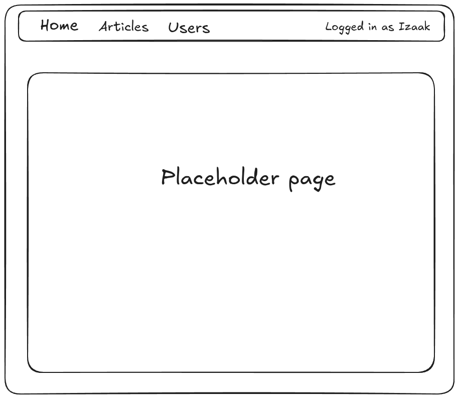
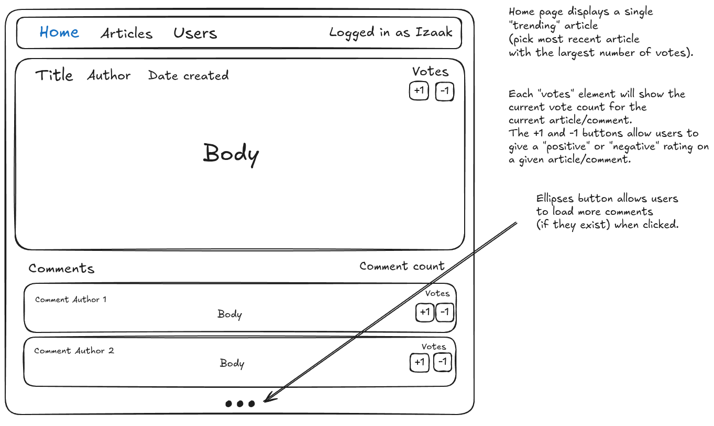
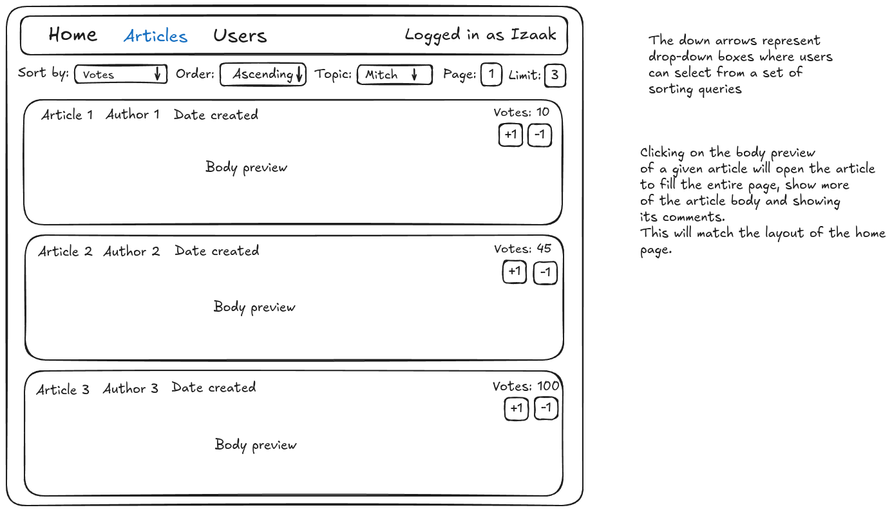
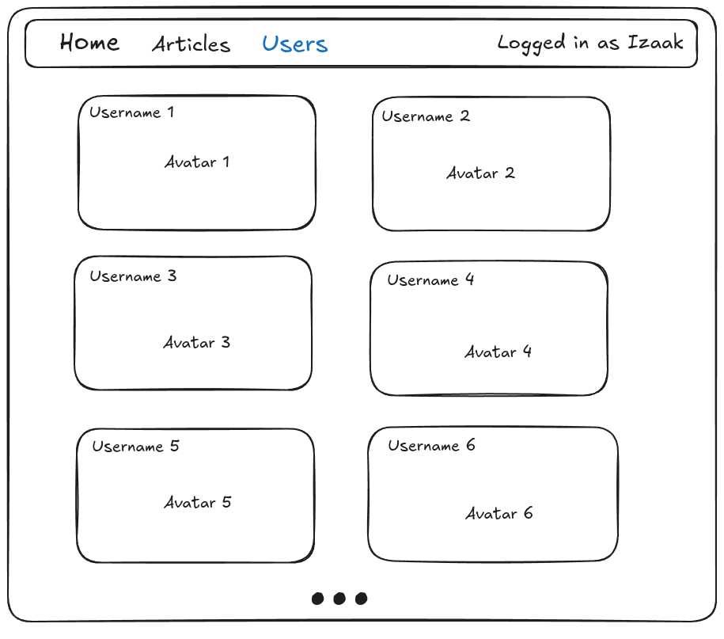
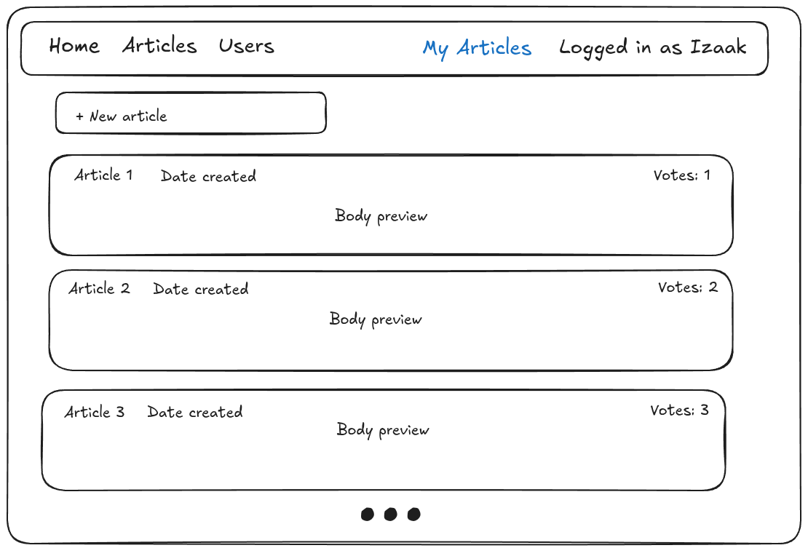
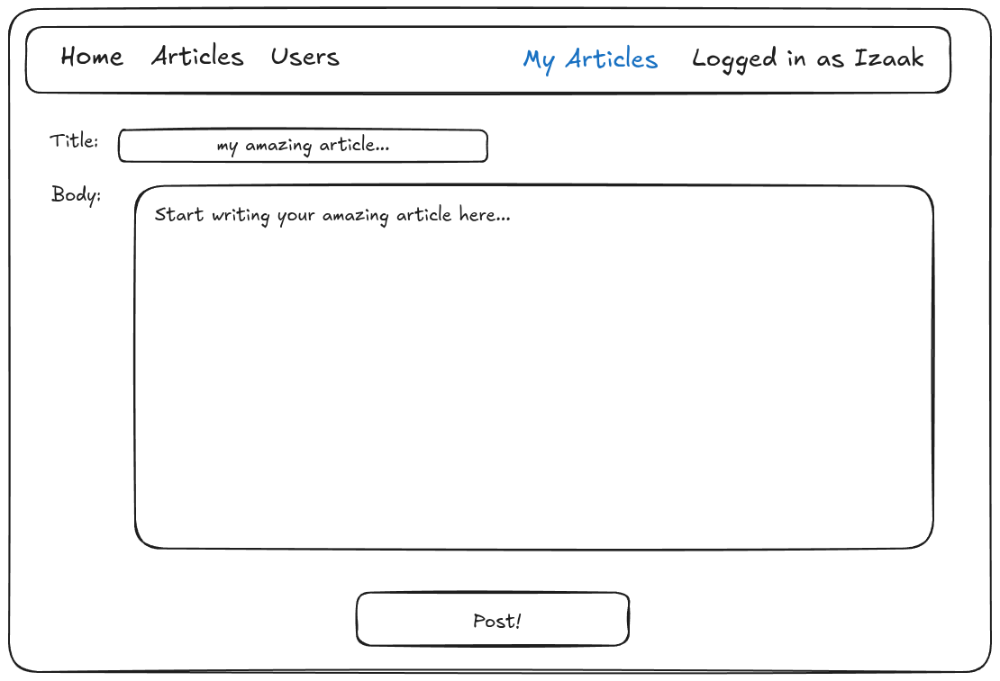
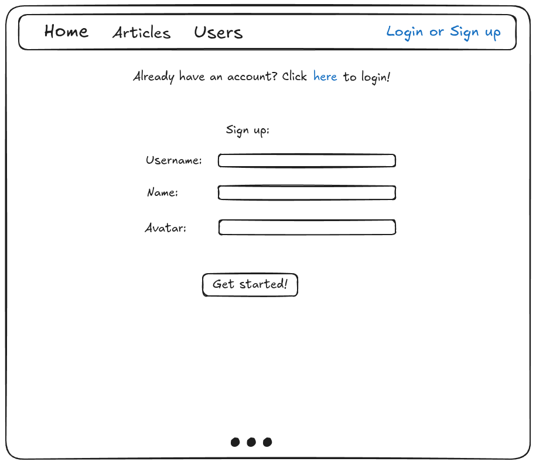
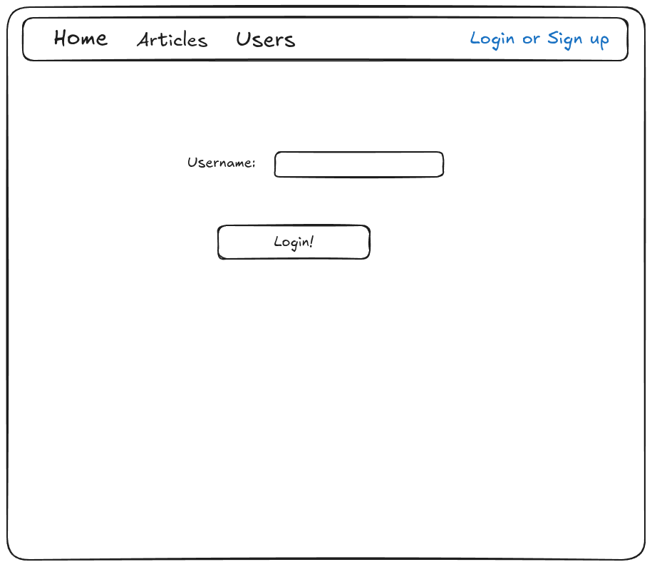
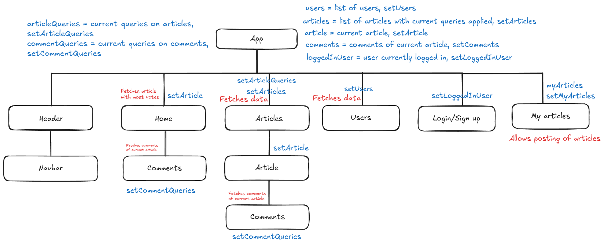

*Note - Added an extra component which is only present in one of the wireframe images (myArticles).
This page will allow users to post an article and view their previous posts.  
This component will only render if a user is logged in.

Wireframe plans:

<h2>Navbar - examples for logged out and logged in</h2> 

<h2>Home</h2>

<h2>Articles</h2>

<h2>Users</h2>

<h2>My Articles - examples for viewing posted articles and posting an article</h2>

<h2>Login/Sign up</h2>

<h2>Component Tree</h2>

